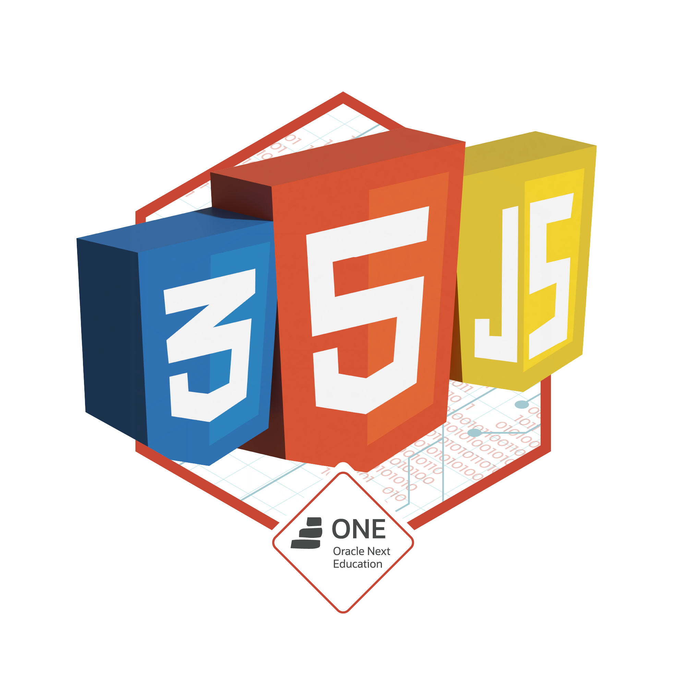

# Welcome to my GitHub profile

💻 I'm a systems development student and junior fullstack developer;

📈 I also study Agile and apply its concepts in my projects.

🌱 My main goal is to successfully work as a developer, in ways that I can contribute meaningfully to a better world!

---

  
  
   

## Most used tools

  
  
  
  
  
  
  

## Contact and social networks

  
  
  

  

  

  

  

## Highlighted projects

  
  
  

## Oracle Next Education badges

  
  
  
  
  
  

