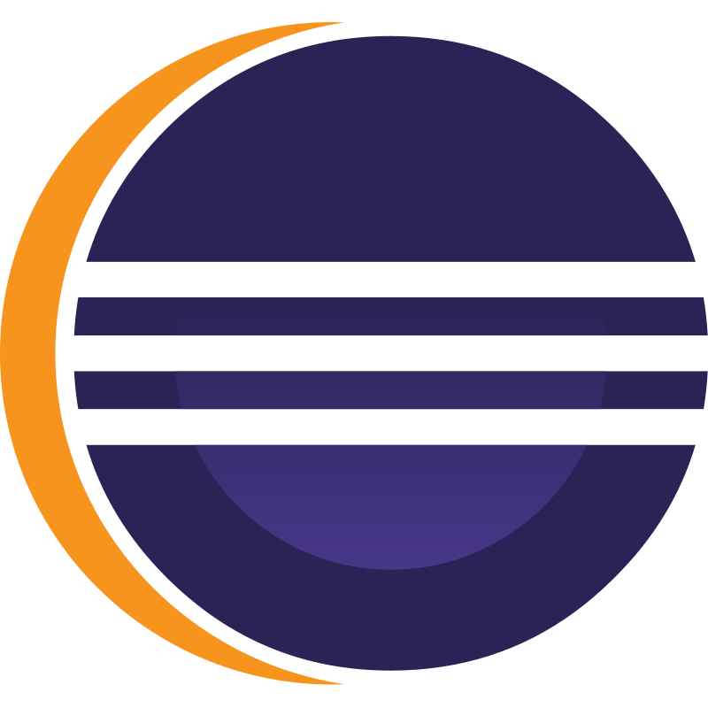
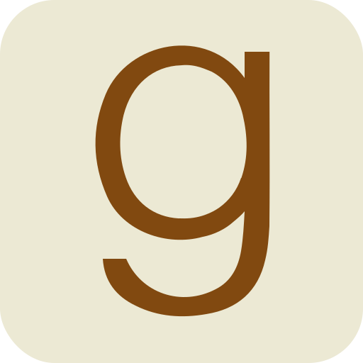
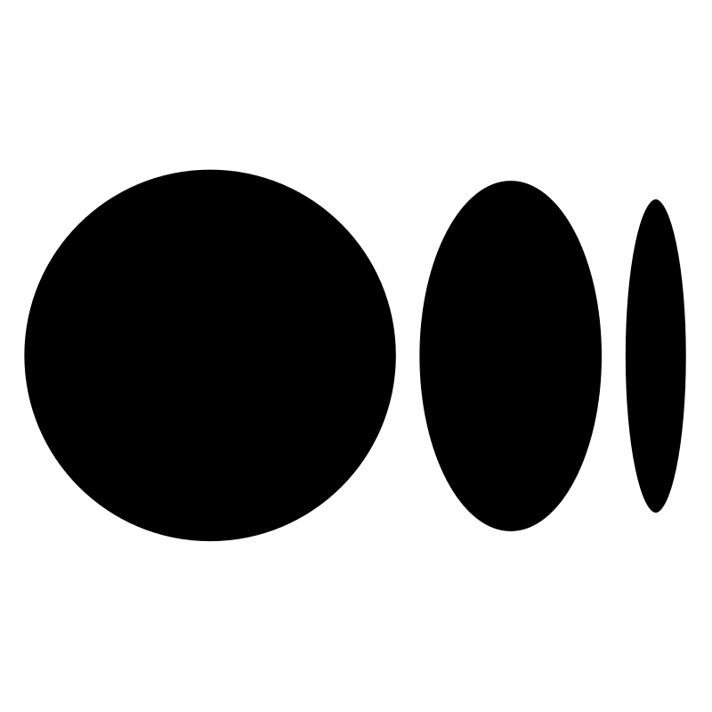
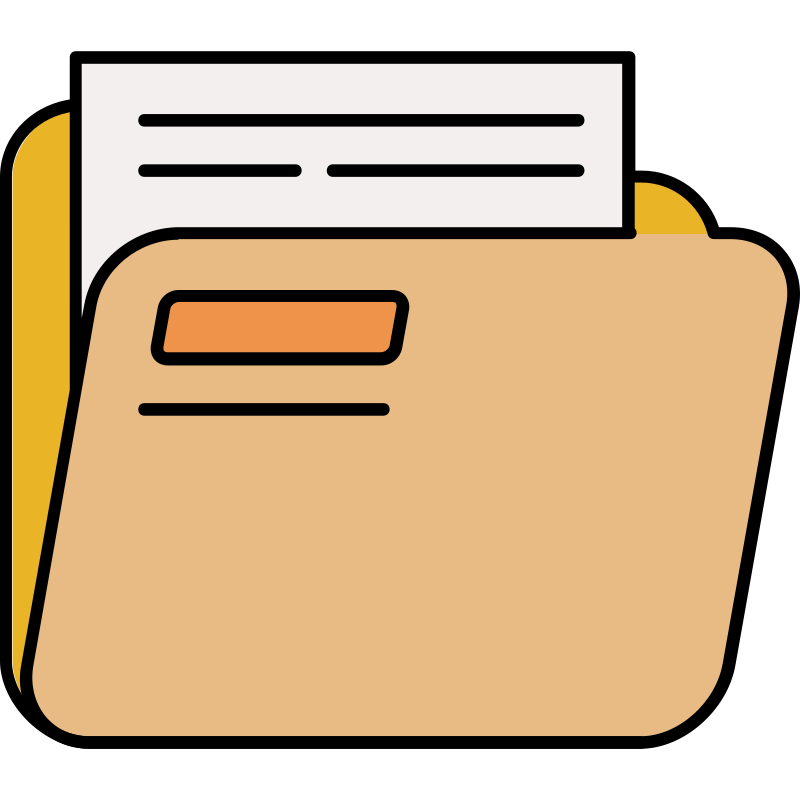

# Welcome to my GitHub profile

💻 I'm a systems development student and junior full stack developer;

📈 I like to study Agile and apply the concepts in my projects;

🌱 My main goal is to succeed work as a developer, becoming a reference in my area of expertise!

📚 I also really appreciate literature and reading is my favorite hobby.

---

  
   

## Most used languages and tools

  
  
  
  
  
  
  
  
  
  

## Contact and social networks

  
  
  
  
  
  
  
  

## Highlighted projects

  
  

## Oracle Next Education badges

<ul style="display:flex;gap:1rem">
  
  
  
  
  
  
</ul>
